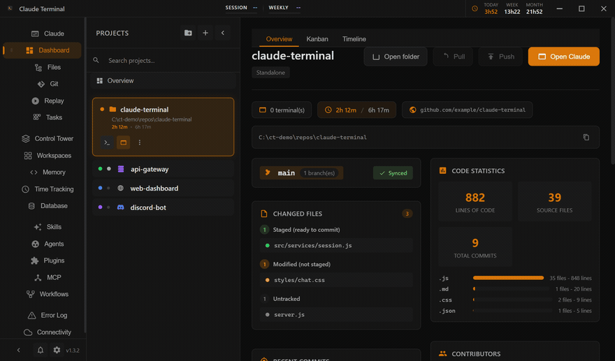

# Hey, I'm Yanis 👋

**20 y/o Software Engineer** building things that scale, for real users.

**Software Developer @ [OVHcloud](https://www.ovhcloud.com)** (alternance) · **Lead Dev @ [SpaceNewRP](https://spacenewroleplay.fr)** · 3rd year CS @ **Ynov Campus** Lille, France

Also freelancing on the side.

I don't just write code. I architect systems, run the infrastructure under them, and ship products people actually use.

## What I'm building

### 🎮 [SpaceNewRP](https://spacenewroleplay.fr) — Lead Developer
**Top 6 FiveM roleplay server in France.** ~650 concurrent players on a weekday evening.

I lead the dev team: architecture decisions, code review, and the systems that keep 650 simultaneous players in sync without the server falling over. Custom job systems, state management, economy, and the tooling the rest of the team builds on.

> `Lua 5.4` `MariaDB` `Redis` `Docker` `Pterodactyl` `NGINX`

### 🚀 [Claude Terminal](https://github.com/Sterll/claude-terminal)
The **first desktop GUI for Claude Code** (Anthropic's AI coding agent). Open source.

Multi-terminal GPU-accelerated rendering, 8 specialized tabs, AI-generated Git commits, a built-in MCP server, 20+ themes.

> `Electron` `xterm.js WebGL` `node-pty` `esbuild`

### 🌌 Quantum Studios
My personal ecosystem. **4 connected apps** on dedicated infrastructure with shared auth.

| App | What it does |
|-----|-------------|
| **Arcade** | 6 real-time multiplayer games (Wavelength, Undercover, Who Of Us, WordBomb, Dilemme, StoryChain) |
| **Lucid** | Collaborative Kanban + real-time whiteboard. Aiming for public SaaS |
| **Writer** | Emotional journaling app, PWA mobile (Capacitor) |
| **QuantumRP** | Minecraft RP server, rethinking what RP can be on MC |

> `React` `TypeScript` `Express` `Socket.io` `Prisma` `Docker` `Clean Architecture`

## Tech I work with

**Languages** · Java, TypeScript, JavaScript, Lua, Python · *learning Go & C#*

**Backend** · Express, Socket.io, Prisma, Redis, RabbitMQ, REST APIs

**Frontend** · React, Tailwind, Electron, Vite

**Databases** · MySQL, MariaDB, MongoDB

**DevOps & Infra** · Docker, Proxmox, NGINX, Traefik, Linux, CI/CD, Pterodactyl, Hetzner VPS

**Tools** · Git, IntelliJ, VS Code, Jira

## Beyond code

I manage a full **Proxmox** setup end to end: gateway VMs, data VMs (Redis + MariaDB), reverse proxies, SSL, and dynamic multi-server deployments.

On the side, **Minecraft plugin development** (Paper/Spigot, UHC frameworks, custom APIs, multi-server architectures).

## Let's connect

---

